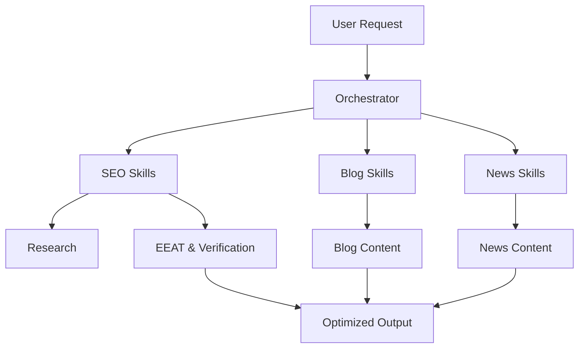
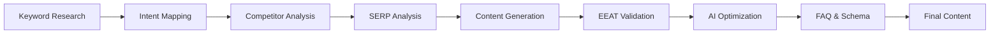

# BTW Group AI Skills


> A structured collection of AI-powered content workflows, SEO automation skills, blog generation pipelines, and news publishing frameworks.

## Architecture Diagram



## Repository Structure

```text
btw-group-ai-skills/
├── skills/
├── blog-skills/
├── news-skills/
└── README.md
```

## Visa Guide Workflow



## Domains Covered

### SEO Skills
- Keyword Research
- User Intent Mapping
- SERP Analysis
- EEAT Validation
- Fact Verification
- AI Overview Optimization
- Schema Generation

### Blog Skills
- Topic Ideation
- Storytelling
- Travel Guides
- Itinerary Builders
- Content Calendars

### News Skills
- News Research
- Source Validation
- Breaking News Workflows
- Google News Optimization
- Social Distribution

## Key Features

- SEO-first content generation
- Modular AI skill architecture
- Workflow orchestration
- EEAT compliance
- Fact-checking framework
- AI Overview optimization
- Humanized content generation

## Goal

Build production-ready AI skill systems that generate accurate, scalable, trustworthy and search-optimized content.

## License

Internal project for BTW Group AI content workflows.