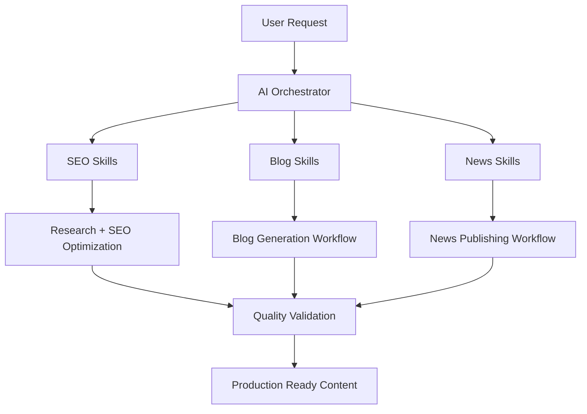

# BTW Group AI Skills

<div align="center">


**Production-ready AI Skill System for SEO, Blog Generation, News Publishing & Content Automation**

</div>

---

## What is this Repository?

BTW Group AI Skills is a modular AI workflow framework containing specialized skills, orchestrators, and content pipelines.

The repository is organized into three major domains:

| Domain | Purpose |
|----------|----------|
| Skills | SEO & Content Engineering |
| Blog Skills | Long-form Content Creation |
| News Skills | News Publishing & Distribution |

---

## Architecture



---

## Repository Structure

```text
btw-group-ai-skills/
│
├── skills/
│   ├── Keyword Research
│   ├── User Intent Mapping
│   ├── Competitor Analysis
│   ├── SERP Analysis
│   ├── Topic Clustering
│   ├── Content Generation
│   ├── EEAT Validation
│   ├── AI Overview Optimization
│   ├── FAQ Schema
│   └── Quality Assurance
│
├── blog-skills/
│   ├── Blog Orchestrator
│   ├── Topic Ideation
│   ├── Storytelling
│   ├── Travel Guides
│   ├── Itinerary Builder
│   ├── Visual Media Briefs
│   └── Content Calendar
│
├── news-skills/
│   ├── News Orchestrator
│   ├── Source Validation
│   ├── Breaking News Triage
│   ├── Google News SEO
│   ├── News Schema
│   └── Editorial Planning
│
└── README.md
```

---

## Skills Workflow (SEO & Content Engineering)


### Includes

- Keyword Research
- User Intent Mapping
- Competitor Analysis
- SERP Analysis
- Topic Clustering
- Meta Optimization
- EEAT Validation
- Fact Checking
- Internal Linking
- AI Overview Optimization
- Structured Data Generation
- Content Humanization

---

## Blog Skills Pipeline


### Includes

- Blog Topic Discovery
- Travel Content Generation
- Persona Segmentation
- Narrative Storytelling
- Destination Guides
- Budget Planning
- Visual Content Briefs
- Content Calendar Planning

---

## News Skills Pipeline


### Includes

- Source Credibility Verification
- Breaking News Workflows
- Inverted Pyramid Writing
- News Roundups
- News Schema Generation
- Discover SEO
- Editorial Planning

---

## Key Capabilities

- SEO-first AI workflows
- AI Overview optimization
- EEAT compliance framework
- Blog automation pipelines
- News publishing workflows
- Fact-checking systems
- Structured data generation
- Humanized content generation
- Production-ready orchestrators

---

## Use Cases

- Travel & Visa Content
- SEO Content Production
- Blog Publishing
- News Websites
- Content Marketing Teams
- AI Content Automation
- Editorial Workflows

---

## Workflow Coverage Matrix

| Capability | Skills | Blog Skills | News Skills |
|------------|---------|------------|-------------|
| Research | ✅ | ✅ | ✅ |
| Content Creation | ✅ | ✅ | ✅ |
| SEO Optimization | ✅ | ✅ | ✅ |
| EEAT Validation | ✅ | ❌ | ✅ |
| Schema Generation | ✅ | ❌ | ✅ |
| Social Distribution | ❌ | ✅ | ✅ |
| Editorial Planning | ❌ | ✅ | ✅ |

---

## Vision

Create a complete AI-powered content operating system capable of producing high-quality, trustworthy, search-optimized, and publication-ready content across multiple content formats.

---

## License

Internal BTW Group project.
