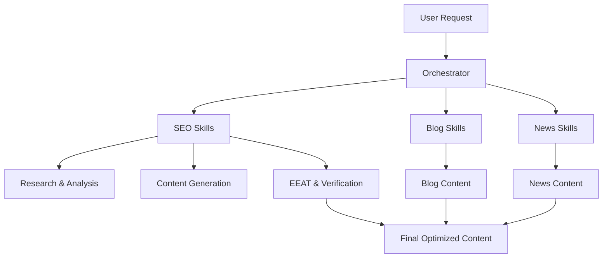

# BTW Group AI Skills

A structured collection of AI-powered content workflows, SEO automation skills, blog generation pipelines, and news publishing frameworks.

## Overview

This repository contains reusable AI skills and orchestrators designed to create high-quality, search-optimized, and AI-friendly content.

### Core Areas

- Visa Guide Content Generation
- SEO Optimization
- Blog Content Creation
- News Publishing
- AI Overview Optimization
- EEAT Compliance
- Content Quality Assurance

---

## Architecture Diagram



---

## Repository Structure

```text
btw-group-ai-skills/
├── skills/
├── blog-skills/
├── news-skills/
└── README.md
```

### skills/

Core SEO and content engineering skills:

- Keyword Research
- User Intent Mapping
- Competitor Analysis
- SERP Analysis
- Topic Cluster Strategy
- Latest Updates Research
- Meta Title & Description
- Content Generation
- Keyword Placement
- EEAT Checking
- Fact Verification
- Internal Linking
- AI Overview Optimization
- FAQ Schema
- CTA Optimization
- Readability Checks
- Grammar & Plagiarism Review
- Humanization
- Content Differentiation

### blog-skills/

Blog content workflow skills:

- Blog Orchestrator
- Topic Ideation & Trends
- Persona Segmentation
- Storytelling Frameworks
- Destination Guides
- Travel Itinerary Builders
- Cost Analysis
- Visual Media Planning
- Listicle & Comparison Builders
- Social Distribution
- Content Calendar Planning

### news-skills/

News publishing workflow skills:

- News Orchestrator
- Source Credibility Validation
- Breaking News Triage
- Inverted Pyramid Writing
- News Roundups
- Article Schema Generation
- News-to-Guide Bridging
- Google News & Discover SEO
- Social Snippet Creation
- Editorial Calendar Planning

---

## Visa Guide Workflow


---

## Main Orchestrators

### Create Visa Guide

Trigger:

```text
create visa guide
```

End-to-end workflow covering:

1. Research
2. SEO Analysis
3. Content Creation
4. EEAT Validation
5. AI Optimization
6. Publishing Preparation

### Blog Orchestrator

Coordinates blog creation workflows from ideation through publication.

### News Orchestrator

Coordinates news research, validation, optimization, and publishing.

---

## Key Features

- SEO-first content generation
- AI Overview optimization
- EEAT compliance checks
- Structured workflow orchestration
- Fact verification framework
- Content quality validation
- Schema generation support
- Blog and News publishing pipelines
- Humanized content workflows

---

## Use Cases

- Travel & Visa Content
- SEO Content Production
- Blog Automation
- News Publishing
- Content Marketing
- AI Content Workflows

---

## Workflow Coverage

| Domain | Coverage |
|----------|----------|
| SEO | Research, SERP, EEAT, AI SEO |
| Blog | Ideation, Writing, Publishing |
| News | Research, Validation, Distribution |
| Quality | Fact Checking, Readability, Humanization |
| AI Optimization | AI Overviews, Schema, Structured Content |

---

## Goal

Build production-ready AI skill systems that generate accurate, scalable, trustworthy, and search-optimized content while maintaining user value and editorial quality.

---

## License

Internal project for BTW Group AI content workflows.